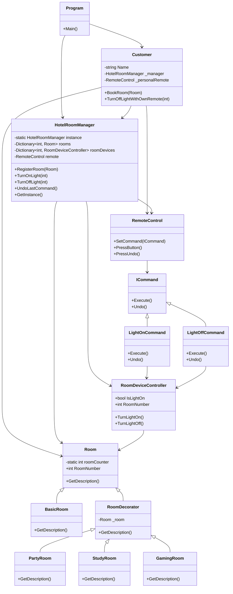

# IRUD-Assignment-2
# 🏨 Smart Hotel Room Control System – IRUD301 Assignment

Welcome to our **Smart Hotel Room Control System** — a console-based simulation designed for our **IRUD301: Design Patterns** assignment.

This project demonstrates practical implementation of the following design patterns:

- 🧩 **Singleton Pattern** – For centralized room management.
- 🎨 **Decorator Pattern** – To dynamically enhance basic rooms with features like study setups, gaming gear, and party setups.
- 🕹️ **Command Pattern** – For device control (currently focused on lights), enabling remote interaction.
-  🐱‍👤 **Multithread System** SIMULATION (Not the other one) of customer environments. Booking, Studying and Most importantly Sleeping.

This README walks you through:
- The overall scenario and logic,
- The class structure and interactions,
- A **Mermaid UML diagram** of our design,

## 🧠 Scenario Overview

Imagine a cozy, tech-enhanced hotel where customers can book customized rooms and control their in-room devices — all with minimal human intervention.

We created a simulation of this idea with:

- 👤 **Customers**: Like *Juanette*, *Jasmin*, and *Tino*, who arrive at different times and book rooms.
- 🛏️ **Rooms**: Each starts as a `BasicRoom`, and can be enhanced with decorators like:
  - `StudySetup`
  - `GamingSetup`
  - `PartySetup`
- 💡 **Devices**: Lights are controlled via the Command pattern.
- 🧠 **Room Manager**: A singleton class `HotelRoomManager` handles room creation and ensures no duplicate instances are created.
- ⚙️ **Multithreading**: Each customer interaction runs on a separate thread to simulate a real-world scenario of multiple guests interacting with the system concurrently.

So when a customer books a room, the system:
1. Initializes the room (with optional packages).
2. Executes device commands (e.g., switch on light).
3. Outputs the full setup to the console.

## 👷🏿‍♂️ UML Classes and Functionality Visual

