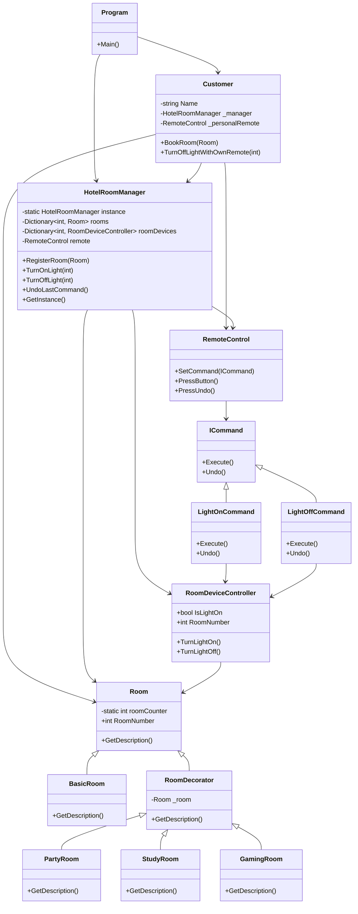

# 🏨 Smart Hotel Room Control System

Welcome to our **Smart Hotel Room Control System** — a console-based simulation designed for our **IRUD301: Design Patterns** assignment.

This project demonstrates practical implementation of the following design patterns:

- 🧩 **Singleton Pattern** – For centralized room management.
- 🎨 **Decorator Pattern** – To dynamically enhance basic rooms with features like study setups, gaming gear, and party setups.
- 🕹️ **Command Pattern** – For device control (currently focused on lights), enabling remote interaction.
-  🐱‍👤 **Multithread System** SIMULATION (Not the other one) of customer environments. Booking, Studying and Most importantly Sleeping.


This README walks you through:
- The overall scenario and logic,
- The class structure and interactions,
- A **Mermaid UML diagram** of our design,
---
# Group Members

This project was completed by the following group members:

- **Jasmin Storm**  
  <br>
   GitHub Profile: [Jasmin's GitHub](https://github.com/Storm-3)  

- **Juanette Viljoen**  
  <br>
   GitHub Profile: [Juanette's GitHub](https://github.com/JuanetteRViljoen)  

- **Tinotenda Mhedziso**  
  <br>
  GitHub Profile: [Tinotenda's GitHub](https://github.com/Passion-Over-Pain)

<br>
<br>
  Each member contributed to different parts of the project, including the Python server, Packet Tracer simulation, and overall system design.
  
---

## 🧠 Scenario Overview

Imagine a cozy, tech-enhanced hotel where customers can book customized rooms and control their in-room devices — all with minimal human intervention.

We created a simulation of this idea with:

- 👤 **Customers**: Like *Juanette*, *Jasmin*, and *Tino*, who arrive at different times and book rooms.
- 🛏️ **Rooms**: Each starts as a `BasicRoom`, and can be enhanced with decorators like:
  - `StudySetup`
  - `GamingSetup`
  - `PartySetup`
- 💡 **Devices**: Lights are controlled via the Command pattern.
- 🧠 **Room Manager**: A singleton class `HotelRoomManager` handles room creation and ensures no duplicate instances are created.
- ⚙️ **Multithreading**: Each customer interaction runs on a separate thread to simulate a real-world scenario of multiple guests interacting with the system concurrently.

So when a customer books a room, the system:
1. Initializes the room (with optional packages).
2. Executes device commands (e.g., switch on light).
3. Outputs the full setup to the console.


## 👷🏿‍♂️ UML Classes and Functionality Visual


## 👷🏿‍♂️ The whole code => To be divided later

```csharp
using System;
using System.Threading;
using System.Collections.Generic;

namespace IRUD_Assignment
{
    // Main entry point for the program
    internal class Program
    {
        static void Main(string[] args)
        {
            Console.OutputEncoding = System.Text.Encoding.UTF8;
            HotelRoomManager manager = HotelRoomManager.GetInstance();

            Thread juanetteThread = new Thread(() =>
            {
                // Juanette arrives first
                Customer juanette = new Customer("Juanette");
                Room room1 = new BasicRoom();
                juanette.BookRoom(room1);
                Thread.Sleep(2000); // Simulate leaving reception
                Console.WriteLine(); // Separate Customer scenarios on console
            });

            juanetteThread.Start();
            juanetteThread.Join(); // Wait for Juanette before Jasmin can book

            // Jasmin's objects declared in Main Thread so that it can be used by Tino's thread to switch off light
            Customer jasmin = new Customer("Jasmin");
            Room room2 = new StudyRoom(new BasicRoom());

            // Jasmin still books before Tino
            Thread jasminThread = new Thread(() =>
            {
                // Jasmin arrives after Juanette
                Thread.Sleep(1000);
                jasmin.BookRoom(room2);
                Thread.Sleep(3000); // Studying
                Console.WriteLine();
            });

            Thread tinoThread = new Thread(() =>
            {
                // Tino arrives last
                Console.WriteLine();
                Thread.Sleep(2500); 
                Customer tino = new Customer("Tino");
                Room room3 = new GamingRoom(new BasicRoom());
                tino.BookRoom(room3);
                Console.WriteLine("Tino wants the lights off in his gaming room.");
                manager.TurnOffLight(room3.RoomNumber);

                //Concurrently => Room 3 and Room 2 lights are switched off
                Console.WriteLine();
                Console.WriteLine("Jasmin is done studying and goes to sleep...");
                jasmin.TurnOffLightWithOwnRemote(room2.RoomNumber);

            });

            jasminThread.Start();
            jasminThread.Join();

            tinoThread.Start();
            tinoThread.Join();

            Console.WriteLine("All customers have finished their sessions. Exiting on next key.");
            Console.ReadLine();
        }
    }

    // Customer class that interacts with HotelRoomManager
    public class Customer
    {
        public string Name { get; }
        private HotelRoomManager _manager;
        private RemoteControl _personalRemote;

        public Customer(string name)
        {
            Name = name;
            _manager = HotelRoomManager.GetInstance();
            _personalRemote = new RemoteControl(); // Independent controller
        }

        public void BookRoom(Room room)
        {
            Console.WriteLine($"{Name} is booking a room...");
            _manager.RegisterRoom(room);
            Console.WriteLine($"{Name} got the room:");
            Console.WriteLine(room.GetDescription());

            // Turn on light using HotelRoomManager
            _manager.TurnOnLight(room.RoomNumber);
        }

        public void TurnOffLightWithOwnRemote(int roomNumber)
        {
            var controller = new RoomDeviceController(roomNumber); // Ideally fetched from manager, simulated here
            ICommand command = new LightOffCommand(controller);
            _personalRemote.SetCommand(command);
            _personalRemote.PressButton();
        }
    }

    // Singleton Manager that registers rooms and executes commands
    public sealed class HotelRoomManager
    {
        private static HotelRoomManager instance;
        private static readonly object _lock = new object();
        private Dictionary<int, Room> rooms = new Dictionary<int, Room>();
        private Dictionary<int, RoomDeviceController> roomDevices = new Dictionary<int, RoomDeviceController>();
        private RemoteControl remote = new RemoteControl();

        private HotelRoomManager()
        {
            Console.WriteLine("Welcome to the Hotel Room Management System.");
            Console.WriteLine("============================================");
        }

        public static HotelRoomManager GetInstance()
        {
            if (instance == null)
            {
                lock (_lock)
                {
                    if (instance == null)
                        instance = new HotelRoomManager();
                }
            }
            return instance;
        }

        public void RegisterRoom(Room room)
        {
            rooms[room.RoomNumber] = room;
            roomDevices[room.RoomNumber] = new RoomDeviceController(room.RoomNumber);
        }

        public void TurnOnLight(int roomNumber)
        {
            if (roomDevices.ContainsKey(roomNumber))
            {
                var command = new LightOnCommand(roomDevices[roomNumber]);
                remote.SetCommand(command);
                remote.PressButton();
            }
        }

        public void TurnOffLight(int roomNumber)
        {
            if (roomDevices.ContainsKey(roomNumber))
            {
                var command = new LightOffCommand(roomDevices[roomNumber]);
                remote.SetCommand(command);
                remote.PressButton();
            }
        }

        public void UndoLastCommand()
        {
            remote.PressUndo();
        }
    }

    // Base class for all rooms
    public abstract class Room
    {
        private static int roomCounter = 0; // Total number of rooms
        public int RoomNumber { get; protected set; } // Current room object number

        protected Room()
        {
            roomCounter++;
            RoomNumber = roomCounter;
        }

        protected Room(int currentRoomNumber)
        {
            RoomNumber = currentRoomNumber;
        }

        public virtual string GetDescription()
        {
            return $"Room {RoomNumber}: A basic room";
        }
    }

    // Concrete base room
    public class BasicRoom : Room
    {
        public override string GetDescription()
        {
            return $"Room {RoomNumber}: Basic Room with standard features.";
        }
    }

    // Base class for decorators
    public abstract class RoomDecorator : Room
    {
        protected Room _room; // Encapsulate the room object to decorate

        public RoomDecorator(Room room) : base(room.RoomNumber)
        {
            _room = room;
        }

        public override string GetDescription()
        {
            return _room.GetDescription();
        }
    }

    // Concrete Decorators
    public class PartyRoom : RoomDecorator
    {
        public PartyRoom(Room room) : base(room) { }

        public override string GetDescription()
        {
            string desc = _room.GetDescription();
            if (!desc.Contains("An upgraded room with the following features:"))
                desc = $"Room {_room.RoomNumber}: An upgraded room with the following features:\n";
            return desc + "• Party Setup (Disco lights, speakers, mini bar).";
        }
    }

    public class StudyRoom : RoomDecorator
    {
        public StudyRoom(Room room) : base(room) { }

        public override string GetDescription()
        {
            string desc = _room.GetDescription();
            if (!desc.Contains("An upgraded room with the following features:"))
                desc = $"Room {_room.RoomNumber}: An upgraded room with the following features:\n";
            return desc + "• Study Setup (Desk, bookshelf, quiet ambiance.)";
        }
    }

    public class GamingRoom : RoomDecorator
    {
        public GamingRoom(Room room) : base(room) { }

        public override string GetDescription()
        {
            string desc = _room.GetDescription();
            if (!desc.Contains("An upgraded room with the following features:"))
                desc = $"Room {_room.RoomNumber}: An upgraded room with the following features:\n";
            return desc + "• Gaming Setup (Gaming PC, RGB lights, recliner chair).";
        }
    }

    // Controls devices in a room => (currently only lights)
    public class RoomDeviceController
    {
        public bool IsLightOn { get; private set; }
        public int RoomNumber { get; private set; }

        public RoomDeviceController(int roomNumber)
        {
            RoomNumber = roomNumber;
        }

        public void TurnLightOn()
        {
            IsLightOn = true;
            Console.WriteLine($"Room {RoomNumber} light turned ON.");
        }

        public void TurnLightOff()
        {
            IsLightOn = false;
            Console.WriteLine($"Room {RoomNumber} light turned OFF.");
        }
    }

    // Command interface with execute and undo
    public interface ICommand
    {
        void Execute();
        void Undo();
    }

    // Concrete commands
    public class LightOnCommand : ICommand
    {
        private RoomDeviceController _device;

        public LightOnCommand(RoomDeviceController device)
        {
            _device = device;
        }

        public void Execute()
        {
            _device.TurnLightOn();
        }

        public void Undo()
        {
            _device.TurnLightOff();
        }
    }

    public class LightOffCommand : ICommand
    {
        private RoomDeviceController _device;

        public LightOffCommand(RoomDeviceController device)
        {
            _device = device;
        }

        public void Execute() => _device.TurnLightOff();
        public void Undo() => _device.TurnLightOn(); // optional reverse action
    }

    // Invoker class that holds and executes commands
    public class RemoteControl
    {
        private ICommand _command;

        public void SetCommand(ICommand command)
        {
            _command = command;
        }

        public void PressButton()
        {
            _command.Execute();
        }

        public void PressUndo()
        {
            _command.Undo();
        }
    }
}

```


